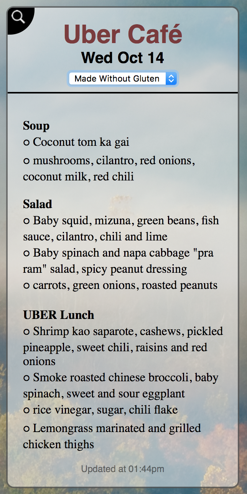
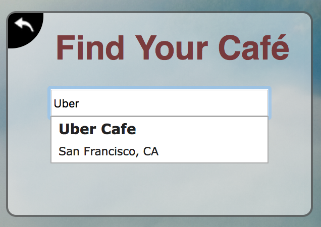

# BonApp Widget

BonApp Widget is an [Übersicht](https://github.com/felixhageloh/uebersicht) widget written in JavaScript. It searches the daily offerings of cafeterias and locations catered by Bon Appetit Management Company for the menu  ([much like this interface](http://www.cafebonappetit.com/)).

  - Search for cafeterias by name
  - View daily menu items by station
  - Filter by dietary preference

### Installation

Widgets are installed by placing them in your widgets folder.

1. **Locate the downloaded widget.** After pressing download the widget will usually be placed in your Downloads folder. Look for a zip file ending in .widget. Unzip the file, resulting in a folder with the same name. Note that some browsers will automatically unzip the file for you.

2. **Open your widgets folder.** Select 'Open Widgets Folder' from the Übersicht menu in the top menu bar.

3. **Move the widget to your widgets folder.** Drag the widget from your Downloads folder to the widgets folder you opened in step 2.

### Is Your Cafe Not Listed?
If you find that your location is associated with Bon Appetit, it could be that the `data.json` file is out of date. You can update this file yourself.

1. Locate `/scripts/getData.py`

2. Change the `totalCafes` number to a higher value to parse more locations

3. Run the following command
    ```sh
    $ python getData.py
    ```

### Development

Want to contribute? Great!

BonApp Widget uses JavaScript, Html, and CSS for familiar web development.
Make a change in your file and instantanously see your updates!

### Credits

- [Matt Kilens](https://github.cokm/mattk410)
- [Drew Volz](https://github.com/drewvolz)

### Screenshots



